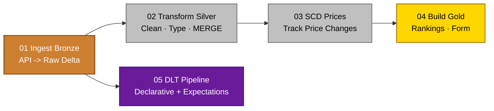

# Fantasy Premier League — Databricks Data Engineering Project

An end-to-end data engineering project built on the Databricks Data Intelligence Platform. Ingests data from the official Fantasy Premier League API, progressively refines it through a medallion architecture (Bronze → Silver → Gold), tracks slowly changing dimensions, enforces data quality with Delta Live Tables, and orchestrates everything with Lakeflow Jobs — all governed by Unity Catalog.

## Architecture

```mermaid
---
config:
  layout: elk
  look: classic
  theme: forest
---
flowchart LR
 subgraph API["FPL API Endpoints"]
    direction TB
        A1(["/bootstrap-static"])
        A2(["/fixtures"])
        A3(["/element-summary"])
        A4(["/entry"])
        A5(["/leagues"])
  end
 subgraph Medallion["Medallion Data Architecture"]
    direction LR
        B[("BRONZE<br>Raw JSON<br>Append + Meta")]
        S[("SILVER<br>Cleaned &amp; Typed<br>Deduped (MERGE)")]
        G[("GOLD<br>Value Rankings<br>Form &amp; Diff")]
  end
 subgraph Mgmt["Management & Governance"]
    direction LR
        UC{{"Unity Catalog<br>Lineage &amp; ACL"}}
        LJ{{"Lakeflow Jobs<br>DAGs &amp; Alerts"}}
  end
 subgraph Databricks["Databricks Lakehouse Workspace"]
    direction TB
        Medallion
        Mgmt
  end
    B == Clean, Parse & Type ==> S
    S == Business Logic & Agg ==> G
    API -- Extract & Ingest --> B
    G == Serve ==> D{{"Dashboard<br>Databricks SQL"}}
    B -. Governed by .- UC
    S -. Governed by .- UC
    G -. Governed by .- UC
    LJ -. Orchestrates .- Medallion

     A1:::api
     A2:::api
     A3:::api
     A4:::api
     A5:::api
     B:::bronze
     S:::silver
     G:::gold
     UC:::governance
     LJ:::orchestration
     D:::dashboard
    classDef bronze fill:#cd7f32,color:#fff,stroke:#8a5522,stroke-width:2px
    classDef silver fill:#c0c0c0,color:#000,stroke:#888,stroke-width:2px
    classDef gold fill:#ffd700,color:#000,stroke:#b8860b,stroke-width:2px
    classDef api fill:#e8f4f8,color:#036,stroke:#036,stroke-width:1px,stroke-dasharray: 3 3
    classDef dashboard fill:#4a90d9,color:#fff,stroke:#2a5a8a,stroke-width:2px
    classDef governance fill:#2e7d32,color:#fff,stroke:#1b5e20,stroke-width:2px
    classDef orchestration fill:#6a1b9a,color:#fff,stroke:#4a148c,stroke-width:2px
    style Medallion fill:#FFF9C4
    style API stroke:#AA00FF,fill:#E1BEE7
    style Databricks stroke:#AA00FF
    linkStyle 0 stroke:#036,fill:none
    linkStyle 1 stroke:#036,fill:none
    linkStyle 2 stroke:#036
    linkStyle 3 stroke:#036,fill:none
```



## Data Source

All data comes from the [Fantasy Premier League API](https://fantasy.premierleague.com/api/bootstrap-static/), which is free and requires no authentication for public endpoints.

| Endpoint | Description | Grain |
|----------|-------------|-------|
| `bootstrap-static/` | Players (50+ stats), teams, gameweeks, positions | Season snapshot |
| `fixtures/` | Every match with scores, difficulty ratings, per-player stats | Match |
| `element-summary/{id}/` | Player fixture-by-fixture history (current + prior seasons) | Player × gameweek |
| `entry/{id}/history/` | Manager gameweek points, chips used, prior seasons | Manager × gameweek |
| `leagues-classic/{id}/standings/` | Paginated league standings | League × manager |
| `event/{gw}/live/` | Live gameweek points breakdown per player | Player × gameweek |

## What This Project Covers

| Skill | Implementation |
|-------|---------------|
| API ingestion | Python `requests` → PySpark DataFrames → Delta tables |
| Medallion architecture | Bronze (raw + metadata) → Silver (cleaned, typed) → Gold (aggregated) |
| PySpark transformations | `explode`, struct access, casting, joins across grain levels |
| Delta Lake MERGE | Incremental upserts for Silver tables |
| SCD Type 2 | Player price tracking with `effective_from`, `effective_to`, `is_current` |
| Window functions | Rolling 5-gameweek form, rank calculations |
| Delta Live Tables | Declarative pipeline with `@dlt.table` and data quality expectations |
| Data quality | `EXPECT`, `EXPECT_OR_DROP`, `EXPECT_OR_FAIL` constraints |
| Unity Catalog | Three-level namespace, table tags, column comments, auto lineage |
| Delta time travel | `VERSION AS OF`, `DESCRIBE HISTORY` |
| Lakeflow Jobs | Multi-task DAG with scheduling, notifications, dependencies |
| Dashboards | Databricks SQL visualizations on Gold layer |

## Project Structure

```
fpl-databricks-project/
│
├── README.md
│
├── notebooks/
│   ├── 01_ingest_bronze.py          # API calls → raw Delta tables
│   ├── 02_transform_silver.py       # Clean, type, deduplicate, MERGE
│   ├── 03_scd_prices.py             # SCD Type 2 for player price history
│   ├── 04_gold_tables.py            # Value rankings, form, differentials
│   └── 05_dlt_pipeline.py           # Declarative DLT with expectations
│
├── sql/
│   ├── setup_catalog.sql            # CREATE CATALOG / SCHEMA statements
│   └── dashboard_queries.sql        # Gold layer queries for dashboarding
│
└── docs/
    └── architecture.md              # Design decisions and data dictionary
```

## Setup

### Prerequisites

- A Databricks workspace ([Free Edition](https://www.databricks.com/try-databricks) or 14-day trial for DLT)
- Python 3.x (for local testing, optional)
- A GitHub account

### 1. Clone and connect

```bash
git clone https://github.com/rapaugustino/fpl-databricks-project.git
```

In Databricks: **Repos → Add Repo → paste the GitHub URL**.

### 2. Create the catalog and schemas

Run `sql/setup_catalog.sql` in a notebook or the SQL editor:

```sql
CREATE CATALOG IF NOT EXISTS fpl_project;
CREATE SCHEMA IF NOT EXISTS fpl_project.bronze;
CREATE SCHEMA IF NOT EXISTS fpl_project.silver;
CREATE SCHEMA IF NOT EXISTS fpl_project.gold;
```

### 3. Run notebooks in order

Execute notebooks `01` through `04` sequentially for the first load. After the initial run, the MERGE logic handles incremental updates.

### 4. (Optional) Set up the DLT pipeline

Requires a Premium workspace. Create a pipeline in **Workflows → Delta Live Tables**, point it at `05_dlt_pipeline.py`, and set the target catalog/schema.

### 5. Schedule with Lakeflow Jobs

Create a job in **Workflows → Jobs & Pipelines** with the task DAG:



Schedule it weekly after the FPL gameweek deadline (e.g., Saturdays at 2 PM UTC).

## Gold Layer Outputs

| Table | Description |
|-------|-------------|
| `player_value_rankings` | All players ranked by points per million, with xG/xA stats |
| `player_form` | Rolling 5-gameweek form: points, minutes, xGI, bonus |
| `fixture_difficulty` | Upcoming fixtures with difficulty ratings per team |
| `differentials` | Low-ownership (<10%) players with high value |
| `player_price_history` | SCD Type 2 history of every player price change |

## Stretch Goals

- [ ] Scrape top 10k managers' picks for a "wisdom of the crowd" optimal team
- [ ] Captaincy optimizer using rolling xGI + fixture difficulty
- [ ] Transfer recommender based on budget, squad, and upcoming schedule
- [ ] Auto Loader streaming simulation with `cloudFiles`
- [ ] Package as a Databricks Asset Bundle for CI/CD

## Tech Stack

- **Platform**: Databricks Data Intelligence Platform
- **Compute**: Serverless (Free Edition) or Jobs clusters
- **Storage**: Delta Lake (managed tables via Unity Catalog)
- **Orchestration**: Lakeflow Jobs
- **Governance**: Unity Catalog
- **Pipeline framework**: Delta Live Tables (Lakeflow Spark Declarative Pipelines)
- **Language**: Python (PySpark) + SQL
- **Data source**: Fantasy Premier League REST API
- **Version control**: GitHub + Databricks Repos

## License

This project is for educational purposes. FPL data is owned by the Premier League. Use responsibly and respect API rate limits.