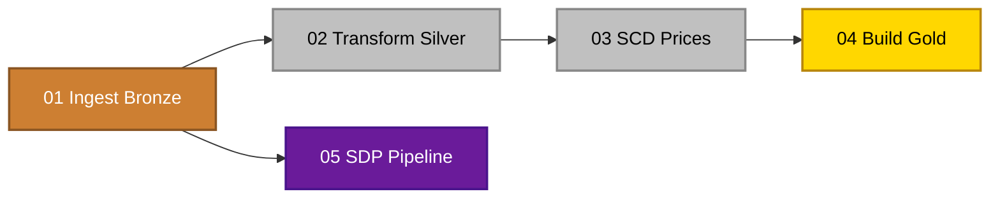

# Fantasy Premier League — Databricks Data Engineering Project

An exploratory data engineering project built on the Databricks Data Intelligence Platform. The primary goal was to get hands-on with Databricks' core features — Unity Catalog, Delta Lake, Lakeflow Jobs, and Spark Declarative Pipelines — by building an end-to-end pipeline around Fantasy Premier League data.

Data is ingested from the official FPL API, progressively refined through a medallion architecture (Bronze → Silver → Gold), and served to a basic SQL dashboard.

## Architecture

```mermaid
---
config:
  layout: elk
  look: classic
  theme: forest
---
flowchart LR
 subgraph API["FPL API Endpoints"]
    direction TB
        A1(["/bootstrap-static"])
        A2(["/fixtures"])
        A3(["/element-summary"])
  end
 subgraph Medallion["Medallion Data Architecture"]
    direction LR
        B[("BRONZE<br>Raw JSON<br>Append + Meta")]
        S[("SILVER<br>Cleaned &amp; Typed<br>Deduped (MERGE)")]
        G[("GOLD<br>Value Rankings<br>Form &amp; Diff")]
  end
 subgraph Mgmt["Management & Governance"]
    direction LR
        UC{{"Unity Catalog<br>Lineage &amp; ACL"}}
        LJ{{"Lakeflow Jobs<br>DAGs &amp; Alerts"}}
  end
 subgraph Databricks["Databricks Lakehouse Workspace"]
    direction TB
        Medallion
        Mgmt
  end
    B == Clean, Parse & Type ==> S
    S == Business Logic & Agg ==> G
    API -- Extract & Ingest --> B
    G == Serve ==> D{{"Dashboard<br>Databricks SQL"}}
    B -. Governed by .- UC
    S -. Governed by .- UC
    G -. Governed by .- UC
    LJ -. Orchestrates .- Medallion

     A1:::api
     A2:::api
     A3:::api
     B:::bronze
     S:::silver
     G:::gold
     UC:::governance
     LJ:::orchestration
     D:::dashboard
    classDef bronze fill:#cd7f32,color:#fff,stroke:#8a5522,stroke-width:2px
    classDef silver fill:#c0c0c0,color:#000,stroke:#888,stroke-width:2px
    classDef gold fill:#ffd700,color:#000,stroke:#b8860b,stroke-width:2px
    classDef api fill:#e8f4f8,color:#036,stroke:#036,stroke-width:1px,stroke-dasharray: 3 3
    classDef dashboard fill:#4a90d9,color:#fff,stroke:#2a5a8a,stroke-width:2px
    classDef governance fill:#2e7d32,color:#fff,stroke:#1b5e20,stroke-width:2px
    classDef orchestration fill:#6a1b9a,color:#fff,stroke:#4a148c,stroke-width:2px
    style Medallion fill:#FFF9C4
    style API stroke:#AA00FF,fill:#E1BEE7
    style Databricks stroke:#AA00FF
    linkStyle 0 stroke:#036,fill:none
    linkStyle 1 stroke:#036,fill:none
    linkStyle 2 stroke:#036
    linkStyle 3 stroke:#036,fill:none
```



## Data Source

All data comes from the [Fantasy Premier League API](https://fantasy.premierleague.com/api/bootstrap-static/), which is free and requires no authentication.

| Endpoint | Description | Grain |
|----------|-------------|-------|
| `bootstrap-static/` | Players (50+ stats), teams, gameweeks, positions | Season snapshot |
| `fixtures/` | Every match with scores and difficulty ratings | Match |
| `element-summary/{id}/` | Player fixture-by-fixture history | Player x gameweek |

## What Was Explored

This project was primarily about learning the Databricks environment. Here's what was built and the platform features exercised along the way:

| Skill / Feature | Where |
|-----------------|-------|
| API ingestion with Python `requests` + PySpark | `01_ingest_bronze` |
| Medallion architecture (Bronze → Silver → Gold) | Notebooks 01–04 |
| PySpark transformations (casting, renaming, joins) | `02_transform_silver` |
| Delta Lake MERGE for incremental upserts | `02_transform_silver`, `03_scd_prices` |
| SCD Type 2 for tracking player price changes | `03_scd_prices` |
| Window functions (rolling 5-gameweek form) | `04_gold_tables` |
| Lakeflow Spark Declarative Pipelines (SDP) with data quality expectations | `05_sdp_pipeline` |
| Unity Catalog governance (three-level namespace, tags, comments, lineage) | `sql/unity_catalog_setup` |
| Delta time travel (`DESCRIBE HISTORY`) | `sql/unity_catalog_setup` |
| Lakeflow Jobs multi-task DAG orchestration | Configured in the Databricks UI |
| Basic Databricks SQL dashboard | `sql/dashboard_queries`, `sql/FPL Dashboard.lvdash.json` |

## Project Structure

```
fpl-databricks-project/
│
├── README.md
│
├── notebooks/
│   ├── 01_ingest_bronze.ipynb       # API calls → raw Delta tables with metadata
│   ├── 02_transform_silver.ipynb    # Clean, type-cast, deduplicate, MERGE upserts
│   ├── 03_scd_prices.ipynb          # SCD Type 2 for player price history
│   ├── 04_gold_tables.ipynb         # Value rankings, rolling form, differentials
│   └── 05_sdp_pipeline.ipynb        # Declarative pipeline with @dp.expect
│
└── sql/
    ├── unity_catalog_setup.dbquery.ipynb   # CREATE CATALOG/SCHEMA, tags, comments
    ├── dashboard_queries.sql.dbquery.ipynb # Gold-layer queries for the dashboard
    └── FPL Dashboard.lvdash.json           # Exported dashboard definition
```

## Setup

### Prerequisites

- A Databricks workspace ([Free Edition](https://www.databricks.com/try-databricks) or 14-day trial for SDP pipelines)
- A GitHub account (for Databricks Repos integration)

### 1. Clone and connect

```bash
git clone https://github.com/rapaugustino/fpl-databricks-project.git
```

In Databricks: **Repos → Add Repo → paste the GitHub URL**.

### 2. Create the catalog and schemas

Run `sql/unity_catalog_setup.dbquery.ipynb` in the SQL editor:

```sql
CREATE CATALOG IF NOT EXISTS fpl_project;
CREATE SCHEMA IF NOT EXISTS fpl_project.bronze;
CREATE SCHEMA IF NOT EXISTS fpl_project.silver;
CREATE SCHEMA IF NOT EXISTS fpl_project.gold;
```

### 3. Run notebooks in order

Execute notebooks `01` through `04` sequentially for the first load. After the initial run, the MERGE logic handles incremental updates.

### 4. (Optional) Set up the SDP pipeline

Requires a Premium workspace. Create a pipeline in **Workflows → Pipelines**, point it at `05_sdp_pipeline`, and set the target catalog/schema.

### 5. Schedule with Lakeflow Jobs

Create a job in **Workflows → Jobs & Pipelines** with the task DAG:



## Gold Layer Outputs

| Table | Description |
|-------|-------------|
| `player_value_rankings` | All players ranked by points per million, with xG/xA stats |
| `player_form` | Rolling 5-gameweek form: points, minutes, xGI, bonus |
| `fixture_difficulty` | Upcoming fixtures with difficulty ratings per team |
| `differentials` | Low-ownership (<10%) players with high value |
| `player_price_history` | SCD Type 2 history of every player price change |

## Tech Stack

- **Platform**: Databricks Data Intelligence Platform
- **Compute**: Serverless (Free Edition) or Jobs clusters
- **Storage**: Delta Lake (managed tables via Unity Catalog)
- **Orchestration**: Lakeflow Jobs
- **Governance**: Unity Catalog
- **Pipeline framework**: Lakeflow Spark Declarative Pipelines (SDP)
- **Language**: Python (PySpark) + SQL
- **Data source**: Fantasy Premier League REST API
- **Version control**: GitHub + Databricks Repos

## License

This project is for educational purposes. FPL data is owned by the Premier League. Use responsibly and respect API rate limits.
